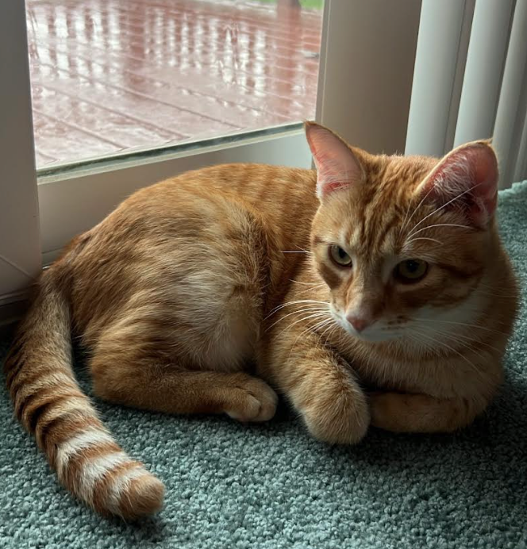

# Notes from University Math Classes
My typed notes from various courses I took in college, including
> Math 53: Differential Equations (includes both lecture and section notes)  \
> Math 115: Functions of a Real Variable \
> Math 108: Intro to Combinatorics 

Also, here's a photo of my cat Pumpkin. 
 

